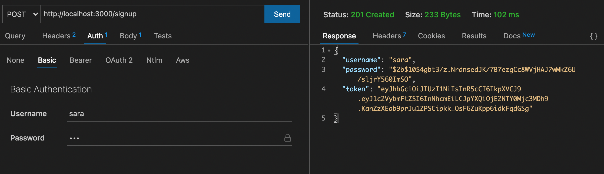
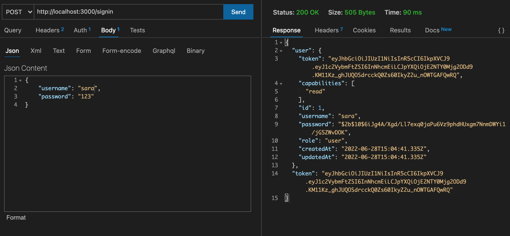
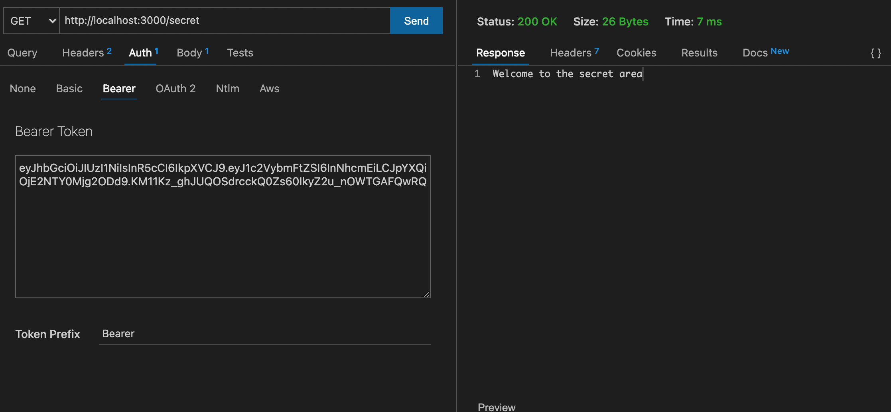
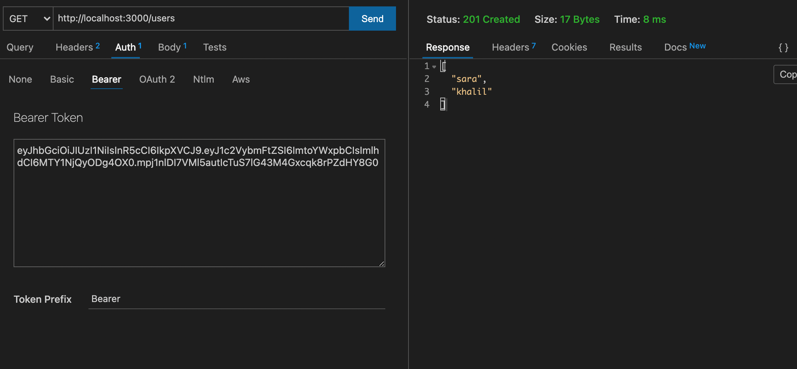
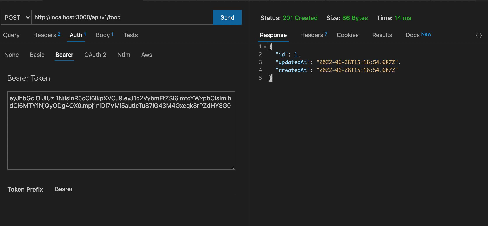
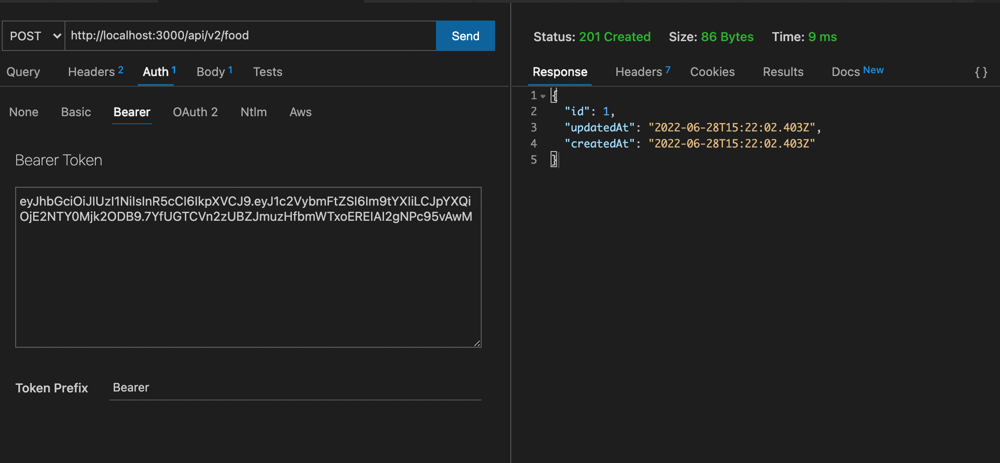

# auth-api

## UML Diagram

## links related to the project

[Heroku app](https://auth-api-sara.herokuapp.com/)

[Actions](https://github.com/saraaltayeh/auth-api/actions)

[pull request](https://github.com/saraaltayeh/auth-api/pull/2)
